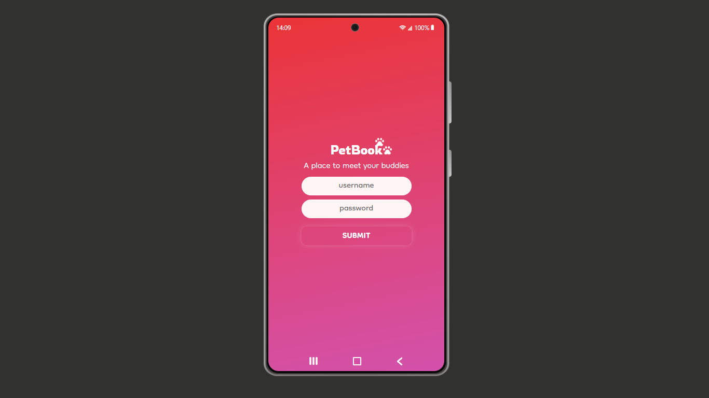

# PET-BOOK: a social network for pets

 
  

In this project I build a simple social network for pets based on codecademy project that you can find on React's course.

I also put a clock system that works according your local time, a login system to control acesss to the app and a button to change the background color, switching between light and dark mode.

## How to deploy this project

1 - Clone this repository to your computer;

2 - Open this repository in the VS Code;

3 - Start a new terminal;

4 - Type "npm install" to install all node dependencies;

5 - After the dependencies are installed, type "npm start";

6 - Wait some seconds until you see the project opening in your main browser.

7 - Log in using the info below:
    
    - otter
    
    - otter123

## Technologies used in this project

- HTML / CSS

- Javascript

- React

## You can watch a video presentation of this project on my linkedin page too:

https://www.linkedin.com/posts/lincolnaraujo_react-project-codecademy-activity-6907098767137624064-3ksH?utm_source=linkedin_share&utm_medium=member_desktop_web
